# 在线幻灯片

> 演示界面：https://ppt.petterobam.cn

近期 TODO：

- [X] :art: 支持 Markdown 文件格式导入
- [X] :art: 支持导出幻灯片为 Markdown 文件
- [X] :bug: 由于使用 Knockout 导致 MathJax 无法及时渲染，需要解决
- [ ] :art: 需要做一个单文件模板用于内部应用直接拥有幻灯片功能（类似于插件）

## 简介

> Online Powerpoint，在线幻灯片。
>  
> 实现参照：https://github.com/Jinjiang/h5slides
>  
> 升级细节：
> 界面设计：仿造熟悉的微软 PPT 软件 Powerpoint
> 实现的功能主要有添加实现大纲略缩菜单功能，增加 HTML5 的非 Js 富文本编辑框，增加自定义主题功能，实现离线文件导入导出等功能。
>  
> PS: 火狐兼容性最好，某些浏览器插件会阻断页面js，如 SuperCopy 等，建议禁用插件。

部分截图：

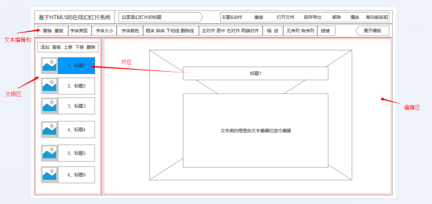

幻灯片编辑页面全览设计草图

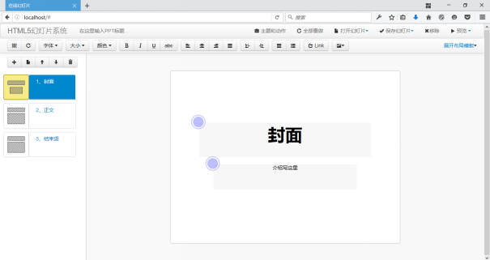

幻灯片编辑界面实现效果图

--------------------------------------------------------------

## 摘  要

进入新世纪以来，信息技术产业迅猛发展，已经逐渐深入到了日常生活的方方面面。通过幻灯片这类的演示文稿软件，能更好、更直观的表达出演讲者所要表达的主题和主要内容，使演讲者有了它在演讲的时候能实现更有秩序和更完美的演讲，提高沟通交流的效率。目前，不论是在科学教育、商业展示、产品说明、比赛演讲等各个方面，都是依赖幻灯片类软件，以实现有效的表达。

HTML5 作为 Web 时代的新星，拥有更高的可用性和更好的体验效果，并且对 HTML 标签和一些属性进行了良好的扩展，使得前端拥有更加丰富的功能。特别是在多媒体方面，HTML5 给出了更简便稳定的实现方案，可以很好的代替 FLASH 和 Silverlight。HTML5 被设计出来，致力于打造一个无缝的网络环境，不管是在 PC 端，还是移动端，都能完美兼容，使得基于它的应用能够有较好的移植性。

基于 HTML5 的在线幻灯片系统，利用 Sublime Text 编辑器和 Fierfox Developer Edition 工具，实现了在线幻灯片系统的编辑模块、保存模块和播放模块。它拥有简洁清爽的界面，自然流畅的体验和全面实用的功能，利用 RequireJS 实现面向模块的架构，有良好的兼容性和扩展性。基于 HTML5 的在线幻灯片系统，仅仅通过浏览器实现幻灯片的编辑、保存、演示，让你摆脱用 U 盘携带存储和系统软件环境的限制。

关键词： HTML5； Sublime Text； RequireJS； 在线幻灯片

## 目  录

|目  录|目  录|
|:--|:--|
|<a href="#1--绪论">1  绪论	</a>|<a href="#43--系统数据设计">4.3  系统数据设计	</a>|
|<a href="#11--项目研究背景">1.1  项目研究背景	</a>|<a href="#431--主题和动作数据">4.3.1  主题和动作数据	</a>|
|<a href="#12--项目研究意义">1.2  项目研究意义	</a>|<a href="#432--幻灯片数据">4.3.2  幻灯片数据	</a>|
|<a href="#13--论文的组织结构">1.3  论文的组织结构	</a>|<a href="#433--导出离线 html 文件 ：文本模板数据">4.3.3  导出离线 html 文件 ：文本模板数据	</a>|
|<a href="#2--开发技术">2  开发技术	</a>|<a href="#434--用户在线数据">4.3.4  用户在线数据	</a>|
|<a href="#21--开发工具">2.1  开发工具	</a>|<a href="#44--本章小结">4.4  本章小结	</a>|
|<a href="#22--关键技术">2.2  关键技术	</a>|<a href="#45--系统实现">5  系统实现	</a>|
|<a href="#221--Bootstrap">2.2.1  Bootstrap	</a>|<a href="#51--系统界面">5.1  系统界面	</a>|
|<a href="#222--KnockoutJS">2.2.2  KnockoutJS	</a>|<a href="#52--数据层封装">5.2  数据层封装	</a>|
|<a href="#223--RequireJS">2.2.3  RequireJS	</a>|<a href="#53--大纲区实现">5.3  大纲区实现	</a>|
|<a href="#23--本章小结">2.3  本章小结	</a>|<a href="#54--鼠标事件和键盘事件">5.4  鼠标事件和键盘事件	</a>|
|<a href="#3--需求分析">3  需求分析	</a>|<a href="#55--富文本编辑器">5.5  富文本编辑器	</a>|
|<a href="#31--功能分析">3.1  功能分析	</a>|<a href="#56--导出功能">5.6  导出功能	</a>|
|<a href="#32--性能分析">3.2  性能分析	</a>|<a href="#57--系统特色功能">5.7  系统特色功能	</a>|
|<a href="#33--系统可行性分析">3.3  系统可行性分析	</a>|<a href="#571--代码编辑框">5.7.1  代码编辑框	</a>|
|<a href="#34--数据存储分析">3.4  数据存储分析	</a>|<a href="#572--简易取色器">5.7.2  简易取色器	</a>|
|<a href="#35--运行环境">3.5  运行环境	</a>|<a href="#573--制作花样主题">5.7.3  制作花样主题	</a>|
|<a href="#36--本章小结">3.6  本章小结	</a>|<a href="#574--动作动态预览区">5.7.4  动作动态预览区	</a>|
|<a href="#4--系统分析与设计">4  系统分析与设计	</a>|<a href="#58--界面兼容性调试">5.8  界面兼容性调试	</a>|
|<a href="#41--系统结构设计">4.1  系统结构设计	</a>|<a href="#59--项目发布">5.9  项目发布	</a>|
|<a href="#411--系统界面结构">4. 系统界面结构 1.1  	</a>|<a href="#510--本章小结">5.10  本章小结	</a>|
|<a href="#412--系统功能结构">4.1.2  系统功能结构	</a>|<a href="#6--总结与展望">6  总结与展望	</a>|
|<a href="#413--系统调试设计">4.1.3  系统调试设计	</a>|<a href="#61--总结完成的工作">6.1  总结完成的工作	</a>|
|<a href="#42--系统组成模块">4.2  系统组成模块	</a>|<a href="#62--展望">6.2  展望	</a>|

## 1  绪论

### 1.1  项目研究背景

1. HTML5

2014 年 10 月 29 日，万维网联盟泪流满面地宣布，经过几乎 8 年的艰辛努力，HTML5 标准规范终于最终制定完成了，并已公开发布。[8]

在此之前的几年时间里，已经有很多开发者陆续使用了 HTML5 的部分技术，Firefox、Google Chrome、Opera、Safari 4+、Internet Explorer 9+都已支持 HTML5。[8]

HTML5 将会取代 1999 年制定的 HTML 4.01、XHTML 1.0 标准，以期能在互联网应用迅速发展的时候，使网络标准达到符合当代的网络需求，为桌面和移动平台带来无缝衔接的丰富内容。[8]

W3C CEO Jeff Jaffe 博士表示：“HTML5 将推动 Web 进入新的时代。不久以前，Web 还只是上网看一些基础文档，而如今，Web 是一个极大丰富的平台。我们已经进入一个稳定阶段，每个人都可以按照标准行事，并且可用于所有浏览器。如果我们不能携起手来，就不会有统一的 Web。” [8]

HTML5 还有望成为梦想中的“开放 Web 平台”(Open Web Platform) 的基石，如能实现可进一步推动更深入的跨平台 Web 应用。[8]

HTML5 赋予网页更好的意义和结构。更加丰富的标签将随着对 RDFa 的，微数据与微格式等方面的支持，构建对程序、对用户都更有价值的数据驱动的 Web。

基于 HTML5 开发的网页 APP 拥有更短的启动时间，更快的联网速度，这些全得益于 HTML5 APP Cache，以及本地存储功能。Indexed DB（html5 本地存储最重要的技术之一）和 API 说明文档。[8]

HTML5 将会最终代替多媒体框架，如 Flash，但是短期看来还不是时候，因为将现有应用 Flash 的网络开发完全转向 HTML5 还需要一段时间。尽管 HTML5 提出了许多优点，但是还可能有某些应用更适合于更灵活的框架。一些主流的大公司都逐步转向使用 HTML5，谷歌于 2015 年 2 月 26 日开始自动将 Flash 广告转换为 HTML5 格式，这可能会加速 HTML5 替代 Flash 的进程，但是这个转变的过程也不是一蹴而就的。[8]

它承诺带来一个无缝的网络。HTML5 会带来一个统一的网络，无论是笔记本，台式机，还是智能手机都应该很方便的浏览基于 HTML5 的网站。因此在设计网站的时候，开发者需要重新考虑用户体验，网站浏览，网站结构等因素使得这个网站对任何硬件设备都通用。[8]

很早就有人设想，能不能“一次设计，普遍适用”，让同一张网页自动适应不同大小的屏幕，根据屏幕宽度，自动调整布局（layout）。[8]

2010 年，Ethan Marcotte 提出了“自适应网页设计”这个名词，指可以自动识别屏幕宽度、并做出相应调整的网页设计。[8]

总结概括 HTML5 有以下优点：

    - 提高可用性和改进用户的友好体验；
    - 有几个新的标签，这将有助于开发人员定义重要的内容；
    - 可以给站点带来更多的多媒体元素（视频和音频）；
    - 可以很好的替代 FLASH 和 Silverlight； 
    - 可移植性好。

2. 幻灯片

在电脑发展史上最辉煌、最具影响力、也引来最多抱怨的软件之一 PowerPoint 今年 29 岁了。很难说 PowerPoint 还将有多少个生日庆典；挖苦这款软件的人几乎同愿意使用的人一样多。

PowerPoint 曾使数不胜数的精彩演示文稿锦上添花，也曾让无穷无尽的愚蠢想法穿上了图形化的华丽外衣。它不仅频频出现在会议室、教室课堂、产品发布会上，也出现在诸如六年级的读书报告中。[9]

1984 年，Gaskins 加入一家衰退中的硅谷软体公司叫做 Forethought 并且雇用了软体开发师 Dennis Austin。Bob 和 Dennis 完善化他的梦想，并设计了"Presenter"实行了该计划。Dennis 与 Tom Rudkin 设计了原始版本的程式。Bob 后来建议了新的产品名"PowerPoint"，该名称最后变成产品正式名称。[9]

然而，随着 PowerPoint 随着版本的升级，越加变得愈加臃肿巨大，从现在还可通用的 PowerPoint2003 的 80MB 到 PowerPoint2013 的 800MB 和 PowerPoint2016 的 900MB。升级的不同步，会需要做很多兼容性工作，这也是导致 PowerPoint 臃肿的一个重要的不可避免的因素之一。由此，当在脱机环境下，拷贝的 PPT 文件如果在没有幻灯片打开播放的软件环境下，只不过是占用存储的垃圾文件。当然，除了 PowerPoint 还有 WPS，WPS 能够做到兼容 PowerPoint 文件，但 PowerPoint 却不会顾及 WPS 的感受，单方面的迁就必然导致因为版本的不同步，造成文件读取效果的差异。同样，WPS 作为一款软件也有 PowerPoint 之前所讲的缺陷。

总结概括幻灯片类软件有如下缺陷：

    - 安装包随着版本的升级愈发臃肿；
    - 针对不同版本的幻灯片文件，涉及大量兼容工作； 
    - 幻灯片文件对软件环境的依赖过于紧密；
    - 市面上不同的幻灯片产品产生的文件不能用一个统一的程序打开。

### 1.2  项目研究意义

根据【项目研究背景】里面的论述，结合 HTML5[13] 的优势和技术支持，针对当下幻灯片类软件的种种不可避免的缺陷，基于 HTML5 的在线幻灯片系统的实现有如下意义：

1. 迎合市场需求，创造更加便捷的幻灯片使用环境

幻灯片已经走进了我们生活的方方面面，不管是科学教育，还是商业展示；不管是论文答辩，还是文学报告；不管是表达情感，还是抒发观点等等。幻灯片的演示，能更好、更直观的表达出演讲者所要表达的主题和主要内容，使演讲者有了它在演讲的时候能实现更有秩序和更完美的演讲，提高沟通交流的效率。特别是在如今信息爆炸的时代，他的重要性尤为突出。

基于 HTML5 的在线幻灯片系统，能够让使用者通过浏览器轻松的使用幻灯片的功能。基于 HTML5 的在线幻灯片系统，能够让使用者随时随地的做到断点续编，在不同的机器上，不同的场景下，只要有浏览器。基于 HTML5 的在线幻灯片系统，能够导出 htnl 格式的文件，并在任意一个平台编辑和演示，即便是脱机状态，只要有浏览器。基于 HTML5 的在线幻灯片系统，能够在任意一种操作系统环境下实现功能，不管是 PC 端的 Windows、Linux、Mac，还是 Android、IOS、Windows Phone，界面相同，效果相同，只要有浏览器。

2. 定位大众 Web 应用，促进 Internet Web 系统的发展进程

从 Web1.0 的单向传递信息，信息由网站拥有者实现信息共享，而普通大众并没有直接贡献信息的渠道；随后 Web2.0 通过网络为媒介，为普通百姓征得话语权，让全人类共建共享信息系统，典型代表是博客、微博、论坛之类的个性型和交互型的网站系统；而 Web3.0 要求的是更加精妙和有用的信息交互，其中阻碍这一目标发展的重要因素就是平台环境的限制，只有纯粹的类文字的简单交流，而其他的类型的文件交流需要通过下载——打开——阅读——转化——简单交流的转化，而打开和转化这两个过程就可能会让信息流失或失真。Web3.0 系统中有这样的特征：用户在互联网上拥有自己的数据，并能在不同网站上使用；完全基于 web，用浏览器即可实现复杂系统程序才能实现的系统功能。

基于 HTML5 的在线幻灯片系统，得益于 HTML5 的部分技术支持实现复杂的幻灯片功能，这一大众 Web 软件的推广使用将促进非纯文本类文件的交流，用户可以通过动态的幻灯片实现更丰富、更流畅、更精妙的交流体验。

3. 升级服务器端系统，实现跨平台软件版本同步和环境的统一

基于 HTML5 的在线幻灯片系统，将系统放在服务器上，用户只需要通过浏览器和网络就可以使用系统的功能。存在的版本不兼容的处理就变得非常简单了。并且，系统导出的离线文件是 html 格式的，只要有浏览器，即使在脱机断网的情况下还是可以实现展示和编辑功能。另外，系统支持导出 txt 格式的文件用于备份，可以在编辑时候将文本内容通过 QQ 等交流工具传递，然后导入系统中，完全不影响本地的兼容性问题。用户不会碰到的版本错误和兼容性问题。同时，浏览器可以安装该系统的插件，实现离线编辑使用。

基于 HTML5 的在线幻灯片系统，主要是实现幻灯片的编辑和展示功能，而其中使用到的 xml 文件，仅仅只是模拟数据库实现用户信息的存储。本人实现的功能类似于一个幻灯片编辑使用的插件，可以嵌入任意系统之中，该插件会提供编辑后的幻灯片的文本内容，可用于数据库存储。于是，不管在什么系统中，只要嵌入这种插件就可以装载幻灯片系统的全部功能。而对于 Web 应用，功能的展示窗口还是浏览器，系统导出的离线幻灯片是 html 格式，打开的工具还是浏览器，由此可得，虽然市面上有不同类型的幻灯片软件，有不同类型后缀的幻灯片文本，但在基于 HTML5 的在线幻灯片系统面前，这些可能的隐患都可迎刃而解，那就是总会有浏览器。作者在幻想，如果能够实现。ppt 等格式的文件的导入，那就真是兼收并蓄了，不过那可能是在线幻灯片系统 2.0 版本的提升功能了。

### 1.3  论文的组织结构

本论文分五个章节，具体章节安排如下：

* 第 1 章 绪论，主要介绍项目研究的背景和意义，针对 HTML5[1] 和幻灯片的当前背景分析以及论述了该应用开发的实际意义。

* 第 2 章 开发技术，主要对应用的开发工具和关键技术进行了简单的介绍。

* 第 3 章 需求分析，主要对应用进行需求分析，介绍了项目开发性能、可行性、数据存储、运行环境以及基于 HTML5 的在线幻灯片系统应用所需实现的功能。

* 第 4 章 系统分析与设计，介绍了系统的设计结构、各个功能模块、设计模块的相关的系统数据的设计，绘制了很多系统的结构图和关系图，为基于 HTML5 的在线幻灯片系统的实现提供了明确的思路和方法。 

* 第 5 章 系统实现，主要介绍了基于 HTML5 的在线幻灯片系统的具体编码实现，详细介绍了系统的重要模块的实现、特色功能、与设计对比的系统界面、界面的兼容性调试和网站发布的实现和操作。

* 第 6 章 总结与展望，对本项目进行一个全面的总结，回顾整个项目的完成过程，并展望该项目的后期发展。

## 2  开发技术	

### 2.1  开发工具

工欲善其事，必先利其器。基于 HTML5 的在线幻灯片系统，作为开源的一个项目，具有更丰富的开发工具的选择。就编辑工具、调试工具而言，个人倾向于 Sublime Text[11] 3 和 Firefox Developer Edition 两大前端利器。运行环境自然是各类浏览器，目前，市场上的浏览器纷繁复杂，种类繁多，不过大体上分为三类：IE 类、Google Chrome 类、其他类。考虑到兼容问题，当今的各类浏览器中分为以下四大内核：

1. Trident 内核，代表产品 Internet Explorer，又称其为 IE 内核。Trident（又称为 MSHTML），是微软开发的一种排版引擎。[10]

2. Gecko 内核，代表作品 Mozilla FirefoxGecko 是一套开放源代码的、以 C++编写的网页排版引擎。Gecko 是最流行的排版引擎之一，仅次于 Trident。[10]

3. WebKit 内核，代表作品 Safari、Chromewebkit 是一个开源项目，包含了来自 KDE 项目和苹果公司的一些组件，主要用于 Mac OS 系统，它的特点在于源码结构清晰、渲染速度极快。缺点是对网页代码的兼容性不高，导致一些编写不标准的网页无法正常显示。[10]

4. Presto 内核，代表作品 OperaPresto 是由 Opera Software 开发的浏览器排版引擎，供 Opera 7.0 及以上使用。它取代了旧版 Opera 4 至 6 版本使用的 Elektra 排版引擎，包括加入动态功能，例如网页或其部分可随着 DOM 及 Script 语法的事件而重新排版。[10]

作者我在开发过程中优先满足用户最多的 IE 类浏览器和个人最爱的火狐浏览器，当然，Google Chrome 如今也很流行，同时对应的 Mac 端的 Safari 的兼容，Google Chrome 就作为测试的承担者了，最后 Opera 也会看看效果。

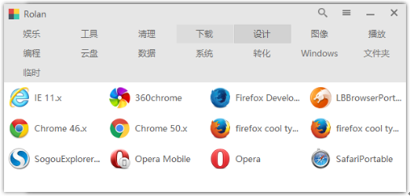

图 2.1 浏览器-测试环境

1. Sublime Text

Sublime Text 是一个代码编辑器，也是 HTML 和散文先进的文本编辑器。Sublime Text 是由程序员 Jon Skinner 于 2008 年 1 月份所开发出来，它最初被设计为一个具有丰富扩展功能的 Vim。[11]

Sublime Text 具有漂亮的用户界面和强大的功能，例如代码缩略图，Python 的插件，代码段等。还可自定义键绑定，菜单和工具栏。Sublime Text 的主要功能包括：拼写检查，书签，完整的 Python API ， Goto 功能，即时项目切换，多选择，多窗口等等。Sublime Text 是一个跨平台的编辑器，同时支持 Windows、Linux、Mac OS X 等操作系统。简而言之，Sublime Text 编辑器有如下优点：

    - 主流前端开发编辑器
    - 体积较小，运行速度快
    - 文本功能强大
    - 支持编译功能且可在控制台看到输出
    - 内嵌 python 解释器支持插件开发以达到可扩展目的
    - Package Control：ST 支持的大量插件可通过其进行管理

对于第六点，充分使用能大大减少重复代码量，提高编码效率，进行 HTML5 开发可以安装如下几样插件：

* Emmet：它的前身是大名鼎鼎的 Zen coding，如果你从事 Web 前端开发的话，对该插件一定不会陌生。它使用仿 CSS[2] 选择器的语法来生成代码，大大提高了 HTML/CSS 代码编写的速度。
* jQuery Package for sublime Text：该插件是编写 js 代码时对 jQuery 的函数进行提示的作用。由于该项目是一个具有很大发展空间的项目，代码内容结构要清晰明了，有较强的扩展性，因此会有大量的封装。同时，jQuery 在兼容性方面有无与伦比的口碑和优势，考虑兼容性问题处理的复杂性和工作量，用 jQuery 处理一些基本的操作，会起到事半功倍的作用。

2. Firefox Developer Edition

Firefox Developer Edition 是 Firefox 专门为开发者研发的浏览器 (Built for those who build the Web)。它主要特色是内建调试功能，集成类似于 Firefox 火狐工具适配器的专用工具，并在浏览器当中内建 WebIDE 编码工具。Firefox Developer Edition 提供的开发工具主要如下：

* WebIDE
* 响应式设计模式
* 页面检测器
* 网页主控台
* JavaScript 调试器
* 网络监测器
* 样式编辑器

3、Axure RP[12]

Axure RP 是美国 Axure Software Solution 公司旗舰产品，是一个专业的快速原型设计工具，让负责定义需求和规格、设计功能和界面的专家能够快速创建应用软件或 Web 网站的线框图、流程图、原型和规格说明文档。作为专业的原型设计工具，它能快速、高效的创建原型，同时支持多人协作设计和版本控制管理。

### 2.2  关键技术 

关键技术方面除了 jQuery[3] 自身的兼容性优势外，主要有如下：

* 针对界面布局的 Bootstrap[14]；
* 针对动态监视的 KnockoutJS[16]；
* 针对模块封装及动态加载 RequireJS[15]；

#### 2.2.1  Bootstrap

Bootstrap[6] 作为一款前端开发框架，其中包含了规范的 css 样式集和 javascript[4] 的插件，特别是其响应式布局，使得不管是 PC 端还是移动端，都能保证不会大出本意的界面效果。 

分析 Bootstrap 插件源码可知，它的每一段插件代码都封装在下面的区域中

```javascript
+ function($) {
    ...
}(window.jQuery)
```

这是基于 jQuery 并对 jQuery 的扩展，很好的维护了代码的统一性，继承了 jQuery 的兼容性。

系统中对 Bootstrap 的使用主要包括一些表单、按钮和图标的 css 样式，以及动态弹出层的模板插件、下拉框的模板插件和导航切换的 tab 插件。特别是弹出层的模板插件，其实现的效果包括锁屏、动态弹出和动态隐藏，只通过设置按钮属性或在按钮中用一句代码就可已实现，确实非常方便。因此，它在【系统界面结构】中的动态弹出的模块层这些界面都会用到，其使用如下：

```html
<div id="confirm-dialog" class="modal hide fade">
    <div class="modal-header">
        <!--data-dismiss 是点击后隐藏弹出模态层的作用-->
        <button type="button" class="close" data-dismiss="modal">×</button>
        <h3 id="confirm-dialog-title">这里是模态框的标题</h3>
    </div>
    <div class="modal-body" id="confirm-dialog-body">
        这里是模态框的内容……
    </div>
    <div class="modal-footer">
        <!--data-dismiss 是点击后隐藏弹出模态层的作用-->
        <button class="btn" data-dismiss="modal" data-action="no">取消</button>
        <button class="btn btn-primary" data-dismiss="modal" data-action="no">确认</button>
    </div>
</div>
```

#### 2.2.2  KnockoutJS

KnockoutJS 遵循 MVVM 模式，即 Model(M)—View(V)—ViewModel(VM) 模式。

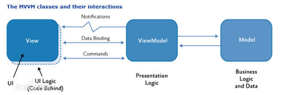

图 2.2 MVVM 模式实现原理图

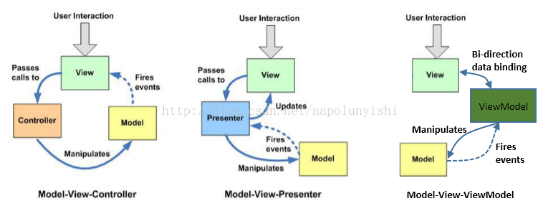

图 2.3 MVC、MVP、MVVM 模式的比较

MVVM 模式是一个关注于前端开发的开发模式，在这种设计模式中：

* Model 来负责业务逻辑和数据封装。
* ViewModel 在模型的基础上对模型数据进行封装，并定义了显示层的逻辑。它负责 Model 与 View 的交互。
* View 则只负责界面和显示。

使用这种模式开发的系统的前端是松耦合的，使得系统更多的关注页面的呈现方式，也增加了前端的灵活性。

#### 2.2.3  RequireJS

RequireJS[15] 是一款遵循 AMD 规范协议的 JavaScript[5] 模拟加载器。而 AMD（Asynchronous Modules Definition），异步模块定义，提供定义模块及异步加载该模块依赖的机制。因此，针对基于 HTML5 的在线幻灯片系统，RequireJS 有如下优点：

* 更好的代码组织方式
* 按需加载
* 更好的处理依赖同时避免命名冲突
* 比较适合基于 HTML5 的在线幻灯片系统这样的独立 APP 型项目，能够做到统一构建的那种

RequireJS 中主要有两个重要的方法：

* define 方法：1）每个 define 模块都会维护一个闭包；2）define 几个关键判断点：、checkLoadedTimeoutId 、 inCheckLoaded、stillLoading。
* require 方法：1）检查依赖的模块，根据配置文件，获取 js 文件的实际路径；2）根据 js 文件实际路径，在 dom 中插入 script 节点，并绑定 onload 事件来获取该模块加载完成的通知；3）依赖 script 全部加载完成后，调用回调函数。

将系统各个功能模块的 js 文件总和到一个文件中，这样减少页面 js 文件的引入，命名该综合文件为 main.js。然后再 index.html 最后添加系统程序入口的定义，就像面向对象语言中 main 函数为主程序一样。用 RequireJS 定义主程序入口和动态加载系统模块集 main.js，代码如下：

```javascript
< script data - main = "js/main"
src = "js/require.js" > < /script> 
```

### 2.3  本章小结

本章主要对应用的开发工具和关键技术进行了简单的介绍。

## 3  需求分析

### 3.1  功能分析

基于 HTML5 的在线幻灯片系统通过分析 PowerPoint 功能界面得到的应用需求，主要实现以下功能：

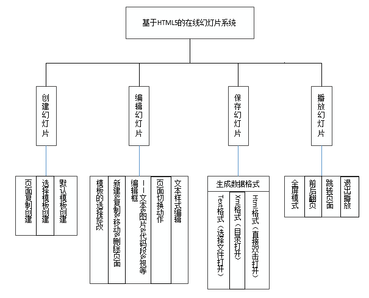

图 3.1 系统功能结构图

1. 创建幻灯片：

默认模板创建、选择模板创建、复制当前创建。

2. 编辑幻灯片：

模板选择、新建/复制/移动/删除页面、编辑框类型、切换动作、文本样式编辑等。

模板，除了默认模板，还支持添加编辑保存模板；编辑框，可以即时修改编辑框类别，目前只有 text/code/img/video；切换动作，集成的动作 css 和 js；文本编辑栏，文本包含文字样式：字体/大小/颜色/对齐、文字链接等。

3. 保存幻灯片：

生成数据文件，包含 text 格式、xml 格式和 html 格式。text 格式，一般用于即时导入，或模板导入制作；xml 格式，xml 是小型数据库，可模拟幻灯片的用户交互网站和云存储；html 格式，导出 html 格式，含 css 和 js，可拷贝于其他地方脱机使用。

4. 播放幻灯片：

全屏模式、前后翻页、跳转页面、退出播放。主要是鼠标的操作，鼠标左键有下一页的功能，右键有前一页、跳转、退出等功能，参照 PowerPoint 的播放界面实现。

### 3.2  性能分析

基于 HTML5 的在线幻灯片系统作为一个面向大众的通用型工具类 Web 应用，对界面美观程度，操作的友好性，良好的用户体验，功能是否明确，扩展性等方面有着较高的要求。为此，软件设计的原则考虑了以下五个方面：

1. 易操作性：考虑到用户习惯和偏向熟悉 PowerPoint 或 WPS 应用，因此设计网页界面时，布局以这类软件的布局为基础，率先显示和突出 PowerPoint 里面常用的使用的功能，使得用户上手时免去再学习成本，直接就能流畅的使用该应用。

2. 友好性：要求应用设计界面简洁大方，避免太多冗余的元素充斥界面；同时，应用中对幻灯片的操作要特别注重鼠标事件的重写，特别是鼠标右键菜单和鼠标滚轮效果，最好达到和 PowerPoint 应用契合，让用户感觉不是在访问网页，而是一个真正应用，用起来自然舒适的应用。

3. 实用性：应用是面向大众的幻灯片类工具，在第一个版本出来时就要求能够立即投入使用；除却幻灯片的模板、主题、动作、编辑这些基本功能，还要能够将编辑结果导出为 html 格式幻灯片的功能，使得用户能够将 html 文件拷到任何地方，在没有网络的环境下，依旧能够编辑和展示幻灯片。

4. 合理性：所谓合理性就是不要让用户产生“还要这样，才能……”的想法，要杜绝用户在使用幻灯片的历史中从来没有出现的问题出现。比如，网页的习惯，图片资源和 html 是分开的，而幻灯片软件中，图片是在。ppt 这类幻灯片文件中的，这就要求在导出离线 html 格式的幻灯片时，图片也要包含在 html 文件中。

5. 扩展性：基于 HTML5 的在线幻灯片系统，作为一个针对复杂软件 Web 化的应用，不可能一蹴而就，实现所有的类似于 PowerPoint 软件这样的所有的功能。这就要求我们在设计应用时，模板、主题、动作、编辑区、大纲区和播放区等等模块的 js 结果要明确，最好能够使用闭包模式将这些区隔离起来，类似于面向对象中类的存在。尔后，当我们需要添加主题、模板或者功能时，能够不影响之前的代码。

### 3.3  系统可行性分析

系统可行性分析的目的是用最小的代价在尽可能短的时间内确定问题是否能够解决，主要是在需求分析完成后，针对需求分析的要求，分析项目在各方面是否可行，是否值得去实现。对基于 HTML5 的在线幻灯片系统的设计与实现主要分析了包括技术可行性，操作可行性，法律可行性。

1. 技术可行性

基于 HTML5 的在线幻灯片系统，核心技术采用的是 HTML5+CSS+Javascript[1]。由第一章的【项目研究背景】可知，在 HTML 标准发展的进程中，超文本标记语言由 HTML 第一版（非标准）、HTML 2.0、HTML 3.2、HTML 4.0、HTML 4.01，发展至如今的 HTML 5。HTML5 已经拥有实现很多功能性应用的基础，而且随着 W3C 的推广、众多网页前端工程师的推崇和 HTML5 自身比之以前的优越性，几乎所有的浏览器都已经对 HTML5 做出了兼容，甚至是以 HTML5 为主的解析环境，这让基于 HTML5 的在线幻灯片系统有着天然的跨平台优势。在界面样式方面主要针对 IE 浏览器做出兼容，因为 CSS 3 的版本中一些选择器和属性对于 IE 浏览器来说是无效的，所以这些兼容性样式对于后期测试来说将是重点。Javascript 的调试一直是前端工程师的头痛点，特别是由于环境的不同，而引出很多难以避免问题要去处理。作者在编写程序的过程中以 jQuery 封装的 javascript 库文件为基础，对敏感性操作进行封装 ，主要包括鼠标、键盘的各种事件，元素某些属性的获取，文件存取的操作等，达到对其他浏览器因兼容性而产生的问题量降到最低，毕竟 jQuery 的兼容性做的事非常好的。同时，鼠标、键盘的各类事件如此丰富，使得基于 HTML5 的在线幻灯片系统能够做到像 PC 端幻灯片应用那样流畅的使用效果。

2. 操作可行性

   基于 HTML5 的在线幻灯片系统，在系统界面和操作流程上是汲取类似于 PowerPoint 这样的幻灯片软件的优秀常用的方面。界面方面，力求简洁大方，重要的部分布局做到与用户记忆相合。操作方面，做到方便快捷，做到每一个鼠标事件，特别是右键菜单和滚轮事件，和 PowerPoint 契合，使得用户操作时不会感到不适，降低用户使用成本。因此，在操作上，基于 HTML5 的在线幻灯片系统易于使用户接受使用。

3. 法律可行性

   HTML5 是开源的语言，开发的功能没有损害国家及公共利益性征，目前也没有出现类似功能的带版权的 Web 应用，程序本身也是按照正常的开发流程，所以不存在任何法律问题，在法律上是完全可行的。 

### 3.4  数据存储分析

1. localStorage：支持 HTML5 的浏览器都已经支持 localStorage，当然，不同的浏览器有不一样的要求，就比如 IE 浏览器虽然支持 localStorage，但是并不支持本地测试，我还需要将项目发布到本地 IIS 上才能正常使用。localStorage 主要用来存储当前正在编辑的幻灯片内容，并且它不和浏览器缓存在一起，只要不是手动清除，一般都不会丢失，具有天然存储前一次历史记录的优势，能够轻松实现断点续编，防止不小心关闭浏览器或系统崩溃等突发状况导致编辑内容丢失的情况。同时，在导出幻灯片时，localStorage 可以在第一次导出时保存复用性的模板信息和通用性功能模块等，提高应用的性能。

2. xml 文件：xml 文件在网页应用中有小型数据库的美称，一般开发小型 Web 应用时，经常用 xml 文件充当数据库的功能，同理，在这里 xml 文件是用于存储用户们的幻灯片数据。这一功能是为了表明，该幻灯片应用能提供接口，将当前编辑幻灯片导出成字符信息存于数据库，也能接收幻灯片信息字符数据，显示在该幻灯片应用中，具有很强的嵌入性，能够嵌入任何系统中。然而，就目前来看，除了 IE 的 ActiveXObject 能够对 xml 增删改，其他的浏览器对 xml 文件只有查看的功能。更有甚者，Google Chrome 对 js 的控制严格到查看 xml 文件都是一种奢侈，不过也能够理解，通常用于充当网站配置文件的 xml 文件，控制页面 js 脚本对其的读写权限是理所当然。

3. txt 文件：这类文件一般用于用户备份幻灯片数据，就好比邮箱邮件备份为。eml 格式，需要时可以导入到其他类型的邮箱一样，需要时可以导入到其他拥有该幻灯片应用的网站中。另外，用于沟通交流时，在双方都打开在线幻灯片的情况下，可以将己方的幻灯片内容迅速的同步到对方的电脑上。

### 3.5  运行环境

本应用的运行环境：

1. 设备：

  + 1）PC 机一台：CPU Intel Core i3 2.30GHz；内存 6GB；硬盘 500GB

2. 软件：

  + 1）Windows 操作系统 + IIS 管理器：用于在本地发布网站。
  + 2）用于兼容的各类内核的浏览器：主要代表有 IE 11、Firefox、Chrome、Opera。
  + 3）用于测试的本土浏览器：360 浏览器、猎豹浏览器、搜狗浏览器、QQ 浏览器和百度浏览器等。

### 3.6  本章小结

本章主要对应用进行需求分析，介绍了项目开发性能、可行性、数据存储、运行环境以及基于 HTML5 的在线幻灯片系统应用所需实现的功能。

## 4  系统分析与设计

###4.1  系统结构设计

#### 4.1.1  系统界面结构

在参考 PowerPoint 软件界面和使用习惯，作者本人对系统的界面进行去杂存精，主要包含幻灯片编辑界面和幻灯片播放界面，用 Axure RP Pro 画出了一些界面的草图。

1、幻灯片编辑界面

1）主界面：主要分工具窗口栏、大纲列表和编辑区


4.1 幻灯片编辑页面全览草图

2）一些与 PowerPoint 相契合的动态界面效果：比如，即时改变当前页的布局模板、鼠标右键大纲页面和鼠标右键编辑区的菜单等等。

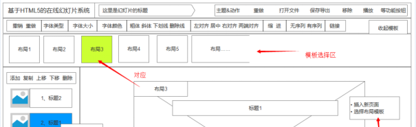

图 4.2 布局模板动态切换草图

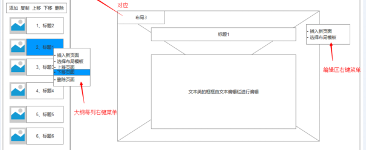

图 4.3 鼠标右键大纲列和编辑区的菜单效果草图

3）动态弹出的模块层：例如，幻灯片主题设置、图片编辑框、视频编辑框、code 编辑框（为代码块进行自动高亮的特殊文本框）、文件在线打开的列表项选择和本地打开的文件选择、导出保存的地址选择、删除重做的确认提示等等。

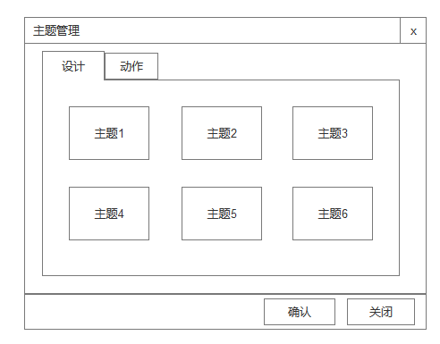

图 4.4 主题管理-设计草图

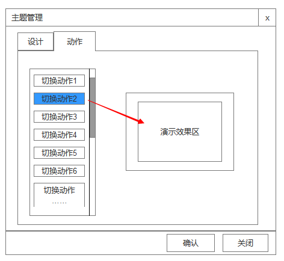

图 4.5 主题管理-动作草图

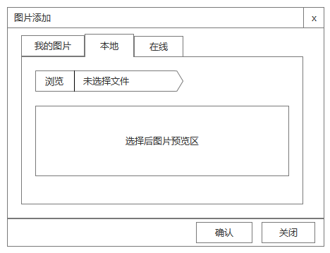

图 4.6 图片编辑草图

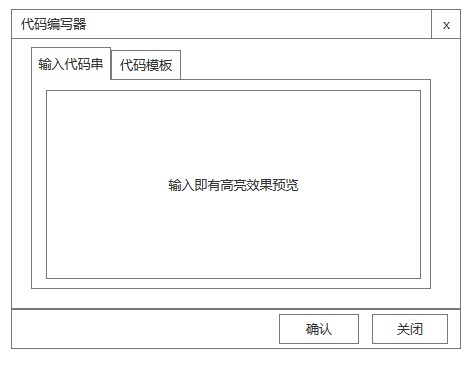

图 4.7 代码编辑器草图


图 4.8 在线文件列表草图


图 4.9 导入本地文件选择草图

2、幻灯片播放界面

幻灯片播放界面要做到全屏效果，因此要做兼容性判断，全屏中定义了大量的鼠标和键盘事件，达到用户无障碍使用。其中定义的鼠标事件动态及界面如下：

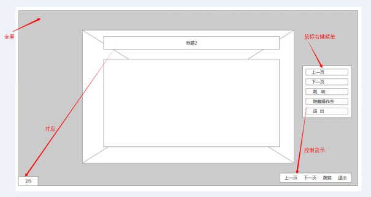

图 4.10 幻灯片播放界面草图

#### 4.1.2  系统功能结构

基于 HTML5 的在线幻灯片系统致力于实现 PowerPoint 这样的软件的复杂 Web 应用，在系统功能设计之初，就要体现合理的分工、分层，原子化、独立化各功能代码块，使得需要组合在一起的功能块能够无障碍交互，不在需要关联的功能不会有接触。然而，在 Javascript 语法中，没有类的功能，代码块不能打包实现相互隔离，没有完整的面向对象机制，确实很难做出一个结构合理的功能设计方案。但是，凡事都有解决办法的，参照 jQuery 的代码封装思想和闭包传参优势，以及 Knockout.js 提供的变量动态监视功能和 Require.js 的动态加载脚本的作用，使得基于 HTML5 的在线幻灯片系统有了初步稳定的可扩展的设计结构。这些技术我在后面会进行详细的介绍，当然，也是因为它们，才使得我们的代码功能既能独立实现，又能在需要的时候相互引用，还能在全局范围内实现隐身，而不会产生冲突，是一个完全对外闭合、可移植的系统。

基于 HTML5 的在线幻灯片系统的功能结构按大模块来分有四方面：

1、基础数据和基础工具模块：

1）基础数据

“storage”——封装专门针对系统的 localStorage 的原子操作，其中要对兼容性进行处理。

“data”——引用“storage”，用于可能的数据复用性操作封装，定义和初始化了一些模板布局数据、主题动作数据、编辑框类型数据等等，对其他所有需要对系统数据操作的模块开放，而“storage”只对“data”开放。

“vm”——引用“data”，用于给整个系统的重要数据添加订阅，动态关注这些变量的变化，相当于系统当前数据的一个数据池，保证界面实时反应。

2）基础工具

“design”——封装幻灯片主题设计模块，用于实现界面主题动态加载和修改。

“transition”——封装幻灯片切换动作模块，用于实现切换动作的设定。

“types/text”——引用“data”、“vm”，用于定义文本编辑框的功能。

“types/img-helper”——图片编辑框扩展工具类，用于图片的兼容性读取，转化。

“types/img”——引用“data”、“vm”、“types/img-helper”，用于定义图片编辑框的功能。

“types/video”——引用“data”、“vm”，用于定义视频编辑框功能。

“types/code”——引用“data”、“vm”，用于定义代码编辑框功能。

“types”——引用“types/text”、“types/img”、“types/video”、“types/code”，将各种类型的编辑框组合再封装，对外统一方法，根据状态调用不同的编辑框对应的方法。

2、幻灯片编辑模块

“title”——引用“data”，用于实现幻灯片名的加载、实时变更和存储的操作。

“page”——引用“data”，用于实现大纲列表数据的获取，动态展示和事实变更等操作。

“status”——引用“data”、“design”、“transition”，主题动作模块的组合再封装，主要用于幻灯片全局主题和切换动作的编辑模块。

 “ctrl”——用于快速切换编辑框类型的模块，使得编辑区上的编辑框类型能够即时修改。

“stage”——引用“data”、“types”、“ctrl”，组合在封装，编辑区主要是由编辑框组成，组合起来构成整个编辑框的完整功能块。

“editor”——引用“vm”、“title”、“page”、“status”、“stage”，组合再封装幻灯片编辑模块，用于初始化整个幻灯片编辑界面状态、事件和数据。

3、幻灯片播放模块

“fullscreen”——用于实现播放时的全屏启动和全屏退出功能，做兼容性控制。

“player”——引用“data”、“design”、“types”、“vm”、“fullscreen”，组合再封装，初始化播放界面以及数据和事件的加载。

4、离线模块

“save”——引用“data”，用于保存当前幻灯片，其中导出功能中，导出为 html 格式的文件具有幻灯片的部分功能，比如部分编辑功能和播放展示功能，这里涉及到大量的模板文件（系统中保存为 txt 格式）的读取，后面将会详细说明。

“open”——引用“data”，用于导入在线、离线（txt 文件）的幻灯片数据，使得用户能断点编辑。

#### 4.1.3  系统调试设计

鉴于系统代码测试和调试的复杂性，如果每次调试都对主文件进行修改，牵连的模板文件也要同步修改，这将会浪费很多的时间和工作量，同时也不利于代码的维护。因此，鉴于这些考虑，作者本人添加了两个文件：

adjust.css 文件：主要用于调节界面的兼容性，根据 id 选择器大于类选择器，后定义属性值覆盖先定义的属性值，对 IE、Firefox、Chrome、Opera 等浏览器进行界面兼容性调试，同时也会有移动端浏览器的测试。虽然布局是流式布局，不过目前优先满足 PC 端浏览器。

adjust.js 文件：主要用于定义一些微调函数，或急需要添加的一些全局函数，或一些简单的工具封装，或临时的一些辅助功能等等。有时界面的调整需要动态 js 解决兼容时，它就可以快速胜任。

这两个文件仅是用于调试时使用，调试结束后，会将其整合到对应的系统功能中。

### 4.2  系统组成模块

为了将基于 HTML5 的在线幻灯片系统的编码条理化、明确化，本人按功能模块画出了各个模块之间的牵连，划分出正常项目的数据、功能、业务、视图等逻辑板块。

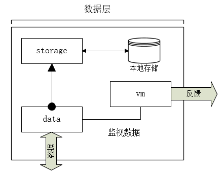

图 4.11 基础数据部分

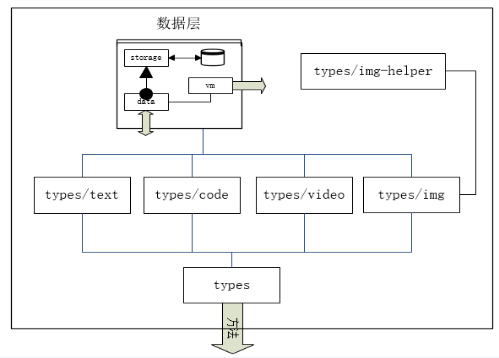

图 4.12 重要基础工具-编辑框

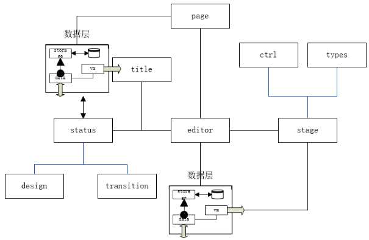

图 4.13 幻灯片编辑模块关系

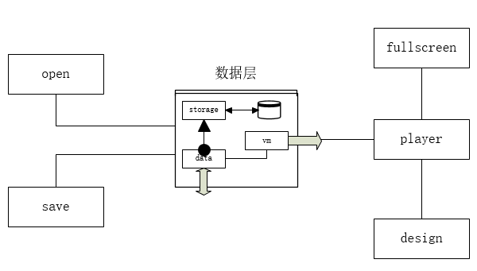

图 4.14 离线模块（左半边）和播放模块（右半边）

### 4.3  系统数据设计

根据前面【系统结构设计】，我们从各个与数据源相关的模块牵扯到的核心部分进行相应的数据格式、类型和存储类型的设计。

#### 4.3.1  主题和动作数据

1、主题是全局的效果，一个幻灯片一个主题，由于全局只有一个主题，因此只用一个字符串作为 ID 就可以标识了。而且主题要做成可扩展的，则每个全局主题效果的 css，最好做成单个文件。必须显示手势密码图案，所以将设置手势密码图案和解锁手势密码图案分别设计了不同的视图。

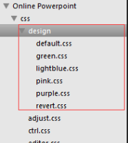

图 4.15 主题文件

主题的 css 文件中一般默认有三种效果：

全局背景样式、每张幻灯片背景样式、幻灯片中所有文字的默认颜色。

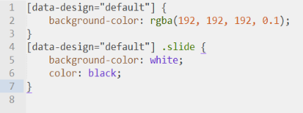

图 4.16 默认主题的 css 样式

上面是根据 css 属性选择器进行元素样式的设计，如果活用 css 选择器，可以做出更多的主题效果，如通过选择器设置第几张幻灯片的样式，甚至幻灯片中各个类型的编辑框的通用样式。

2、动作在目前只支持所有幻灯片的统一切换动作的设置，在后续版本中加入时序计数器或切换状态判断，应该就可以给每个编辑框加动作了，其数据设计和主题一样，并支持扩展。

当然，主题列表和动作列表的信息数据要在“data”中初始化，如果要支持可扩展是话这些列表信息应当放在 xml 的配置文件中，但是目前鉴于 Chrome 浏览器限制了 js 读取 xml 文件，所以就放在 js 文件中初始化了。

表 4.1 主题列表

|序号|	key	|title|
| :----:| :----| :----:|
|1|	'default'  |	默认  |
|2	|'revert'|	反默认|
|3|'pink'|可爱粉|
|4|'green'	|文青绿|
|5|		'lightblue'	|清亮蓝|
|6|	'purple'	|高雅紫|

表 4.2 动作列表

|序号|	key	|title|
| :----:| :----| :----|
|1	|'horizontal'|常规|
|2|'vertical'|垂直|
|3|'cubic-horizontal'	|立方|
|4|	'cubic-horizontal-inner'	|立方 插切|
|5|	'cubic-vertical'	|立方 垂直|
|6|	'cubic-vertical-inner'	|立方 垂直 插切|
|7|	'doors'|	开门式|
|8|	'zoom-in'	|淡入|
|9|	'zoom-out'	|淡出|
|10	|'sublime'	|拉升淡出|
|11|	'fly'	|飞入|
|12	|'fall'|	下落|

#### 4.3.2  幻灯片数据

整个幻灯片的数据除了全局的标题、全局的主题和全局的动作以外，还有每张幻灯片的数据等信息。鉴于 json 数据和 js 对象之间无缝转化的优势，我们用 json 格式存储和解析整个幻灯片信息，如下是整个幻灯片信息的 json 数据模型：

```jaon
{
	"design":"全局主题",
	"transition":"全局动作",
	"title":"全局标题（幻灯片名）",
	"slides":[每张幻灯片上的信息组成的数组]
}
```

而每一张幻灯片包含该页幻灯片的 ID、模板信息和内容组，内容组的每个又有编辑框的属性，包含编辑框的类型和编辑框内的信息。下面是 json 数据模型：

```json
"slides": [
	{
		"sid":"当前幻灯片 ID",
		"layout":"当前布局（normal/subtitle/double/double-subtitle/title/imax）",
		"items":{
			"内容组别（title/subtitle/sutitle2/content/content2）":{
				"type":"编辑框类型（text/img/video/code）",
				"value":"编辑框内的信息"
			},{…}…
		}
	},{…}…
]
```

这里解释一下内容组别，为了降低系统的难度，初级版本的系统，幻灯片上的编辑框不是随便随机可以添加的，而是限制好个数上限和布局的，根据布局调节好这些内容组别（title/subtitle/sutitle2/content/content2）的显示和隐藏、位置和大小，这就是为什么 items 里面的模块没有位置和大小信息的原因。如图 3.4.2-3，幻灯片布局是“普通”、“两列正文”、“含两列正文和子标题”的“title”内容组的样式：

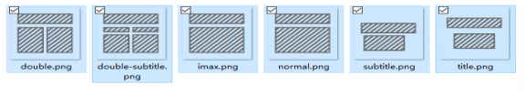

图 4.17 各布局概览图

表 4.3 布局列表

|序号|	key	|title|
| :----:| :----| :----|
|1	|'normal'|普通|
|2|'title'|含标题|
|3|	'subtitle'	|含子标题|
|4	|'double'	|两列正文|
|5|	'double-subtitle'	|含子标题和两列正文|
|6	|'imax'	|纯文本|

如果要实现编辑框随意添加，位置随意拖动，大小随意设置，那么布局 css 文件的某些样式也要存到 slides 的 items 里面的每张幻灯片的信息里面去了。

#### 4.3.3  导出离线 html 文件 ：文本模板数据

导出的离线文件有部分编辑功能和播放功能，而没有文件导入和导出的功能。而且，导出的 html 格式的文件仅仅是一个 html 文件，因此，一些系统的界面上用到的图片要转化成字符流格式（src=”data:image/png; base64, 字符流”）, 特别是一些动态设置的布局图片，在大纲区要用 js 特别处理。

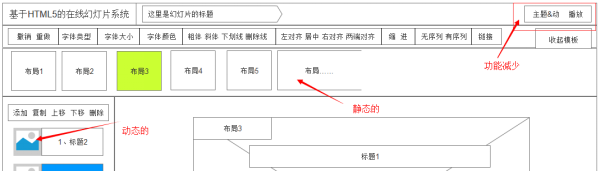

图 4.18 导出离线 html 界面草图

导出的实质是将字符串 html、css、js 的字符串保存为 html 格式的文件，css 放在 html 的 ` `  ` <style type = 'text/css'></style> `  `  ` 里面，js 的放在 `  `  ` <script type="text/javascript"></script> `  ` ` 里面，然后拼接起来。为了处理和修改方便，作者本人将这些独立的部分分开，用通用的 txt 格式的文本存储这些模板，并将这些文本模板放在根目录下的 template.html 文件夹下面。

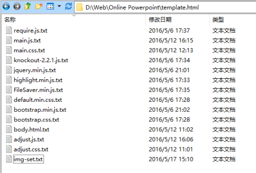

图 4.19 用于生成 html 文件的模板数据的文本列表

这些模板文本里面很多数据是和系统的一致对应的，但是为了处理一些冲突、以及除去一些功能等，不免有些与系统对应的文件有所不同之处，这些具体要在实现的时候做具体的调试和规划。

#### 4.3.4  用户在线数据

用户在线数据仅仅是用来实现交互的在线模块，用于表现幻灯片系统有提供输入和输出幻灯片数据的能力，可用于数据库存储，能够有很好的嵌入性和兼容性。

考虑到语言问题，这里我们用 js 操作 xml 文件模拟数据库的操作：

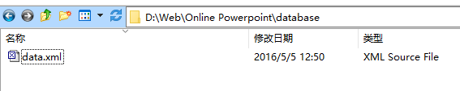

图 4.20 数据库文件目录

```xml
<?xml version="1.0" encoding="UTF-8"?>
<users>
	<user id="用户 ID ">
		<slide id = "幻灯片文件 ID">
			<title>幻灯片名。ppt</title>
			<content>整个幻灯片信息 json 格式的数据</content>
			<time>创立时间</time>
		</slide>
		<…>
		…
	</user>
</users>
```

如果，向数据库设计那样总结出表结构，主要有用户表和幻灯片表。不过这里将两张表合在一起，除去了用户的无关信息，只保留主体的幻灯片信息，还级联了用户和幻灯片的从属关系，操作更简便。

### 4.4  本章小结

本章介绍了系统的设计结构、各个功能模块、设计模块的相关的系统数据的设计，绘制了很多系统的结构图和关系图，为基于 HTML5 的在线幻灯片系统的实现提供了明确的思路和方法。

 

## 5  系统实现

基于 HTML5 的在线幻灯片系统如果一味的平铺直叙的实现 PowerPoint 的每项功能，非但不能取得良好的进展，还会因为功能繁杂，失去重点而使得产品黯然失色。况且，PowerPoint 也不是一天两天就能完成的，这样在长期没有突破的情况下，会让人在编码过程中倍感乏味。不若，在开始着手实现的前，不必执着与实现所有功能，先挑出最常用的、最实用的和最关键的部分，将其列成目标，逐个击破，从而实现该幻灯片系统的最核心的部分，为后来的版本升级打下坚实的基础。

目前而言，已经重点突破的部分有：

* 深度封装数据操作，添加适宜的数据监视，使得数据层从根源上杜绝隐患；
* 优化大纲区的显示效果，实现无缝动态刷新，并将这性能嵌入基本页面操作；
* 集中突破鼠标左键、滚轮、右键事件，兼并实现键盘事件，优化用户操作；
* 实现 html 格式文件导出，突出系统跨平台、免安装、可脱机的巨大优势。 

### 5.1  系统界面 

系统界面与【系统界面结构】的设计的对比，如下是对应的效果截图：


图 5.1 幻灯片编辑界面

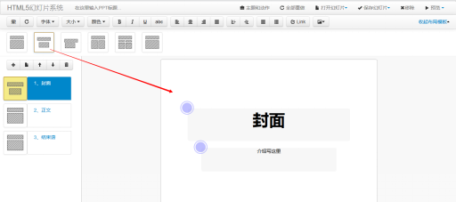

图 5.2 布局动态切换

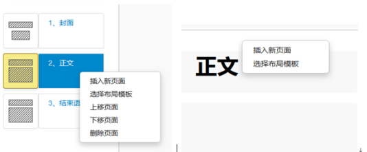

图 5.3 鼠标右键大纲列和编辑区的菜单

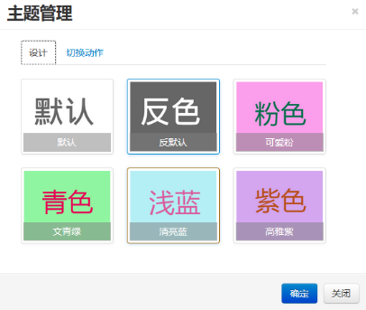

图 5.4 主题管理


图 5.5 图片编辑选择

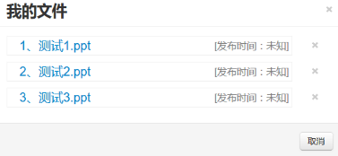

图 5.6 在线文件列表

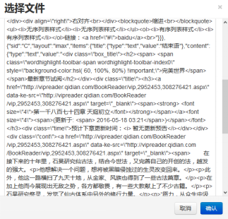

图 5.7 导入 text 格式的幻灯片

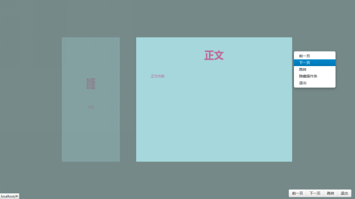

图 5.8 播放时切换页面

### 5.2  数据层封装

在前面【系统功能结构】中的分析，我们知道系统的数据层的操作主要是“storage”、“data”和“vm”三个模块组成。其中“storage”模块，负责本地存储操作。本地存储操作是保证断点续编的关键，用于防止浏览器误关、浏览器闪退等不可见异常导致编辑数据的丢失。

其中“storage”中用到的本地存储对象是对 window.localStorage 的一个兼容性扩展，在浏览器支持 window.localStorage 时，使用 window.localStorage，不支持时使用 IE 的 userData。虽然 IE8 以后的浏览器都支持 window.localStorage，但是 IE 浏览器的 localStorage 不支持本地测试，因此为了维持稳定，还做了本地文件打开或网站文件打开的判断。

 “data”模块对“storage”模块进行了更细致的封装，还定义和初始化了系统的布局信息、主题信息、动作信息和编辑框类型信息等等，对外提供了对这些数据的细致的操作。

“vm”模块引用“data”模块，其中对幻灯片名，大纲列表，当前主题，当前动作，当前编辑的幻灯片和当前编辑的幻灯片的布局等都添加了 knockout[7] 的监视，用于绑定前台视图，实现动态变化时，界面自然，不等待刷新，不产生闪烁效果。

	在“vm”中，通过 knockout 给一些变量添加订阅和监视，这样就可以在前台实现绑定。当变量值有差异时，knockout 就会通知界面，做出相应的动态调整。“vm”中对“data”里面的数据进行动态监视的主要有幻灯片名（title）、幻灯片名的编辑状态（editingTitle）、大纲区列表（pageList）、当前主题（currentDesign）、当前动作（currentTransition）、当前布局（curremtLayout）和当前编辑框（currentItem）等。

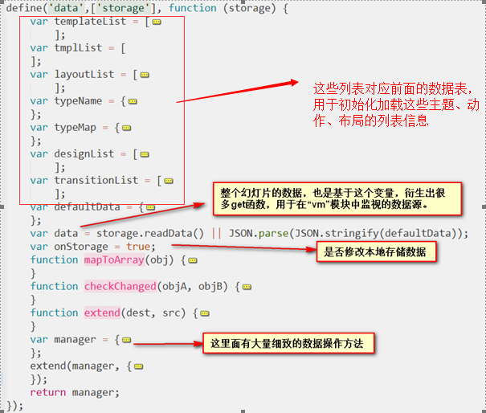

图 5.9“data”模块的实现

### 5.3  大纲区实现

大纲区除了 4.1.2 中运用到的动态绑定技术，实现动态刷新外，还定义了很多按钮的操作，而这些操作结束后还要保证界面信息符合要求，是要做出一些调整的。由于大纲区是幻灯片的全局，这里出现问题或界面与编辑区不一致，是很影响体验效果的。大纲区顶部有个操作栏，定义了的添加页面、复制页面、上移页面、下移页面和删除页面的六个操作。但是，执行这些操作是会导致 IE 浏览器上的大纲区的布局图片丢失的，作者猜测是因为 IE 浏览器的缓存机制缺陷，所以当 knockout 动态变更的图片地址时，由于没有发出请求，浏览器才加载不出图片资源。

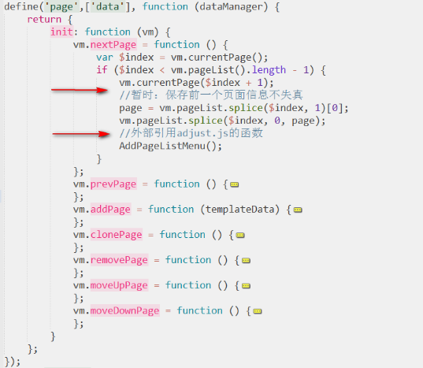

图 5.10 “page”模块的实现

代码中“暂时：…”是作者本人的注释习惯，虽然用那个方法解决了图片丢失问题，但是在每个操作函数中加入这样的代码段，很不符合设计规范，因此用“暂时”注释，表示优待优化。下面的注释是后来添加的大纲区右键的菜单代码，adjust.js 中的部分方法会在后期整合到对应的模块中去。对于像 addPage 那样动态添加页面的操作，要给添加项定义新的右键菜单方法。这也是个人觉得图片丢失的解决方法不好的原因之一，这样虽然解决了问题，但是每个操作都像是添加过新页面，都要运行一遍 AddPageListMenu 函数，来绑定右键菜单。


图 5.11 界面动态绑定大纲区域列表

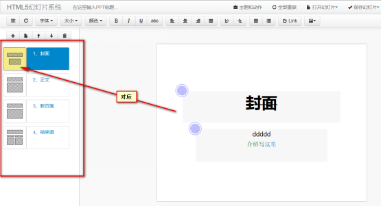

图 5.12 大纲区动态绑定的界面效果

### 5.4  鼠标事件和键盘事件

优秀的鼠标事件和键盘事件会大大增加应用的体验感官，让用户能够流畅的使用应用。基于 HTML5 的在线幻灯片系统中重点对大纲区、编辑区和播放界面定义了鼠标和键盘事件，其中包括大纲区的左键选中事件和右键菜单事件、编辑区的滚轮事件和右键菜单事件以及播放界面的左键下一页事件、右键菜单事件和键盘事件。

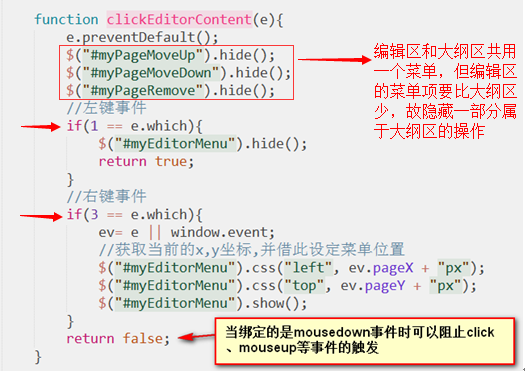

图 5.13 鼠标左右键事件

还要注意的是浏览器有全局的右键菜单事件，要对其进行屏蔽：

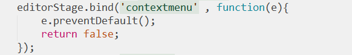

图 5.14 屏蔽全局的菜单事件

当然，也可在“contextmenu”事件中定义具体事件，然后返回 false，同样可以实现右键菜单事件。

滚轮事件是幻灯片软件使用中最常用的部分，然而 web 应用通常会忽略这一部分，往往因此丢失掉了一个完美的功能。然而，滚轮事件还时常涉及到兼容性问题，因此要在 jQuery 上面对滚轮事件做各个浏览器的兼容性扩展。

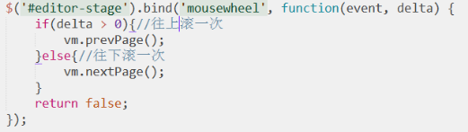

图 5.15 鼠标滚轮事件实现

键盘事件是对播放功能的一个扩展，在没有鼠标的情况下用键盘操作，实现了键盘事件就可以用无线遥控器对幻灯片进行操作了。

表 5.1 键盘各键值对应的事件

|序号	|键值	|按键名称	|功能|
|:--:	|:--:	|:--	|:--:|
|1 	|13 	|Enter 键  |跳转页面|
|2 	|27 	|Esc 键  |退出全屏|
|3	|37 	|LEFT ARROW 键 (←) |上一页|
|4	|38	|UP ARROW 键 (↑)	|上一页|
|5	|39	|RIGHT ARROW 键 (→) |下一页|
|6	|40	|DOWN ARROW 键 (↓)	|下一页|

由于还没有较好的组合键实现方法，因此暂时不能为编辑区添加更多的键盘事件。

### 5.5  富文本编辑器

目前的文本编辑器功能繁杂，而且很多是在后台语言辅助的情况下实现的，需要对应语言的运行环境。不仅如此，文本编辑框的功能是通过 js 绑定的，编辑栏是紧贴在文本编辑框上面，每次编辑时还要重复绑定，不符合简洁设计原则，且不利于扩展，况且界面效果也不能和 PowerPoint 相契合，因此这些文本编辑器都不能达到要求。

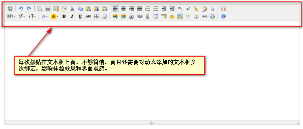

图 5.16 传统的 html 编辑器效果

1、HTML5 的 contenteditable 属性：传统的 html 编辑器几乎都会采用 html 的 iframe 标签，实现对文本的 html 样式编辑，并且还要载入大量的 js 和 css，使得代码环境紊乱，还容易产生冲突和不可预知的错误。不过，天无绝人之路，HTML5 的优势又凸显出来了，就是他的 contenteditable 属性。不管是 ifram、body、div，还是 p、span 等容器标签，只要加入了 contenteditable=”true”属性，HTML5 就可以将其变为可编辑框。而且这样的可编辑框不像 input 和 textarea 那样简单的文本编辑框，还是一个可接受 html 页面上复制的编辑框，甚至是 word 上面复制的文本内容，能够保证文本样式不丢失。


图 5.17 添加了 contenteditable 属性的 div 复制网页文本的效果

2、JavaScript 的 execCommand 方法：要想实现工具栏独立于编辑框，使得工具栏能对所有可编辑的区域发挥作用，并且不管该编辑区域是原先就有，还是后来动态添加的。通过 JavaScript 的 execCommand 方法都能对全局的编辑区域发挥效果。该方法的使用就简单的一句即可：

document.execCommand( commandStr [, 交互方式，动态参数])

其中 commandStr 支持的操作多达 70 多种，目前而言，本系统仅使用了十几种，包含撤销（undo）、重做（redo）、字体类型（FontName）、字体大小（FontSize）、字体颜色（ForeColor）、粗体（bold）、斜体（italic）、下划线（underline）、删除线（strikeThrough）、对齐方式（justifyLeft，justifyCenter，justifyRight，justifyFull）、缩进（indent，outdent）、序列（insertUnorderedList，insertOrderedList）、链接（CreateLink）等。


图 5.18 系统的文本编辑工具栏

经过绑定事件测试，这些功能完全可用，而且当需要扩展功能时，也可以完全不需要修改之前的代码实现扩展。

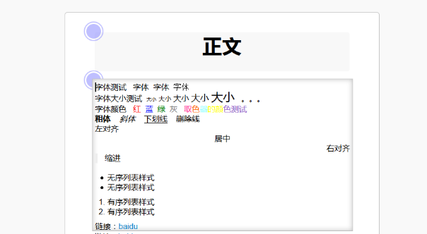

图 5.19 系统用 execCommand 的编辑效果

### 5.6  导出功能

导出功能可以说是在线幻灯片系统最不可或缺的功能之一，也是该类应用核心意义所在。我们之所以编辑幻灯片是用来展示给别人看的，导出为 html 格式有利于携带和分享，像教学类的幻灯片导出还可以作为资料文件，学习和阅读。

实现导出为单个 html 文件，简单的思路就是将这些 web 文件（js、html 和 css）糅合到一起。但是，还需要剔除一些不必要的功能，而且这些并不是完全复制粘贴，还要考虑很多容错性的处理。在【系统数据设计】的 3.4.3 节就讲到，需要将页面上一些静态的图片地址改成字符流格式，有的还需要用 js 动态设置 img 的 src 属性。同时，还需要自己制作模板数据文本，跟随开发的脚步，在测试调试过程中还要同步修改模板数据文本。这里，作者使用 Beyond Compare 软件进行文本差异的对比，能够很方便快捷的完成同步和调整。 

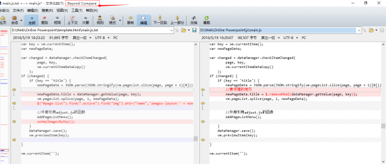

图 5.20 Beyond Compare 文本差异对比

模板和图片等方面准备好后，就可以导出了。在导出的时候，第一次会先将这些文件存到本地存储里面去，这样下次导出就可以直接得到了，不用再读文件。

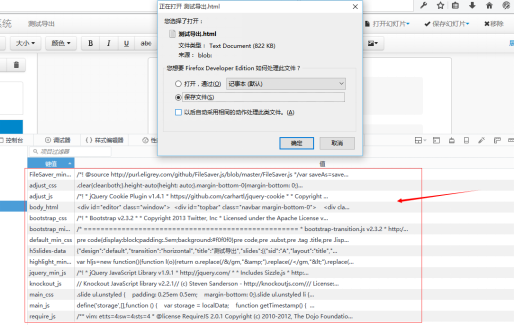

图 5.21 第一次导出，模板文本内容读到本地存储中

最后，到处的 html 文件根据各浏览器的测试，已经兼容 IE 和 Firefox，但是对于 Chrome 还是有些许界面的问题，只支持播放的功能。

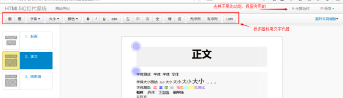

图 5.22 导出后的离线界面

### 5.7  系统特色功能

基于 HTML5 的在线幻灯片系统，利用 Web 的优势，可以实现很多特色功能。

* 代码编辑框
* 轻量取色器
* 在线制作主题
* 动作动态预览区

#### 5.7.1  代码编辑框  

代码编辑框可以将代码贴入其中，然后系统会根据代码中的关键字渲染关键字的颜色等等。这里作者本人用到了 highlight.js，由于其是由闭包写成，同时有如下优点：

* 支持 71 种编程语言的语法解析；拥有 44 种样式
* 自动检测编程语言
* 同时为多种编程语言代码高亮
* 支持各种标签
* 与任何 js 框架兼容

使用时我们将代码块放入 ` `  ` <pre><code></code></pre> `  ` ` 标签中，highlight.js 会自己解析其中的代码，实现高亮。

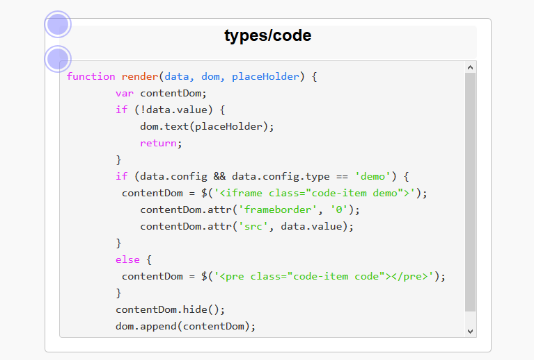

图 5.23 代码编辑框效果

#### 5.7.2  简易取色器

取色器的插件多如牛毛，但是没有一个好用的取色器能够适应该幻灯片系统的文本编辑框，因此，作者本人根据其他的借鉴其他取色器的实现，改写了一个简易的取色器，点击时能够实现文本字体颜色设置。

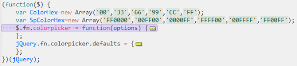

图 5.24 简易取色器功能代码

由代码可知，这是对 jQuery 的一个扩展，取色器并不是引擎渲染的配色器，而是排列组合的 100 多种颜色提供选择，再最后给取色的 mouseup 事件最后添加一个回调事件改变文本编辑框的颜色即可。

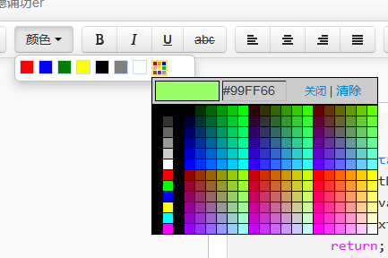

图 5.25 简易取色器实现效果

#### 5.7.3  制作花样主题

幻灯片主题是纯 css 实现的，如果能够开放用户自己制作主题的功能，然后将其保存在主题库中，该应用的主题就可以快速丰富，并且用户可以自己挑选使用别人制作的主题。这样的模式下，在线幻灯片系统就能轻易地实现主题市场的建立。

	随着 css 编写的的复杂程度，可以做出很多丰富多彩的主题。如果给主题的 key 值加上额外的前缀或后缀，让 js 语言来判断是否存在这些前缀或后缀，来赋予页面全局不同的动作。比如，“multi-”前缀的“multi-random”主题，就会根据不同的页面序号，赋予不同的页面背景。

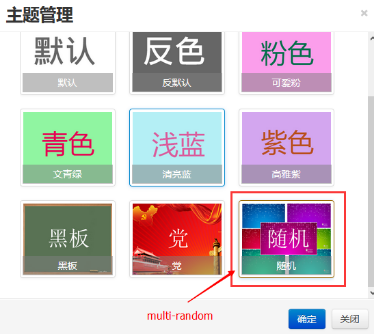

图 5.26 随机主题

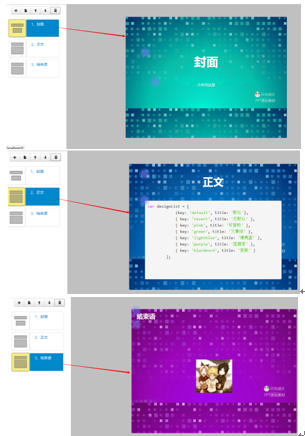

图 5.27 随机主题效果

切换动作的实现是增加在线幻灯片活力的重要部分，虽然目前对动作方面还不能实现和 PowerPoint 那样如此丰富多样的设置功能，但是根据 Web 效果，可以预览循环切换的动态效果。

循环切换的效果实现，首先是获取与 css 对应切换效果关键字，将切换舞台设置的 data-transition 属性为该切换关键字，在舞台内添加切换实体，系统中是用 10 个 div 模拟，然后按顺序推进 slide-pre、slide-current、slide-next 三个样式在 div 的 class 中的移动。一次移动为一次事件函数，实现一次切换动作，用 js 时钟函数实现循环切换：

```javascript
var loopTimer = setInterval（ 一次切换， 循环间隔[毫秒]）
clearInterval(loopTimer) //清除时钟函数
```

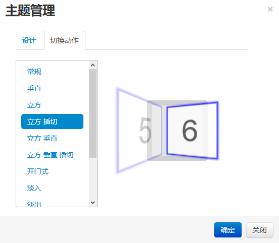

图 5.28 动态切换预览效果

### 5.8  界面兼容性调试

由于系统核心代码都是由闭包实现，RequireJS 定义和动态加载，作者本人编写的插件或引入的第三方库大都是对 jQuery 的扩展，也不太容易出现冲突。因此，界面兼容性调试处理，除了部分环境型的 js 功能外，大都是 css 问题。然而，css 问题大多又乱又杂，没有太多需要阐述的，下面是 JS 相关的界面调试：

1. 本地存储方面：在【数据层封装】已经阐述，这里不做赘述。

2. 鼠标滚轮事件 jQuery 的兼容性扩展：在【鼠标事件和键盘事件】中已经阐述，不做赘述。

3. 去除大纲区标题中文字的标签和样式：大纲区的标题是对应幻灯片的标题，而幻灯片的标题是文本编辑框，可编辑的，会产生标签和样式。因此，绑定时要去除样式。
    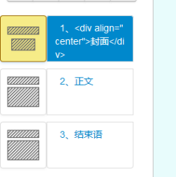

    

    图 5.29 未处理的标题中会有 html 标签

    

    

    

    图 5.30 去除字符串中 html 标签的 jQuery 扩展

    

4. 播放时全屏兼容性处理：不同的浏览器内核，对全屏的调用也不同，一般有 IE 的 ms、Firefox 的 moz、Chrome 的 webkit 和其他通用标准的。

表 5.2 全屏兼容操作

|浏览器类别	|开启全屏	|退出全屏|
|:--:	|:--:	|:--:|
|IE	|msRequestFullscreen	|msExitFullscreen|
|Firefox	|mozRequestFullScreen	|mozCancelFullScreen|
|Chrome	|webkitRequestFullScreen	|webkitCancelFullScreen|
|Others	|requestFullscreen	|exitFullscreen|

### 5.9  项目发布

基于 HTML5 的在线幻灯片系统是一个 Web 应用，自然要发布到服务器中去，作者本人将自己的电脑改成一个服务器。

 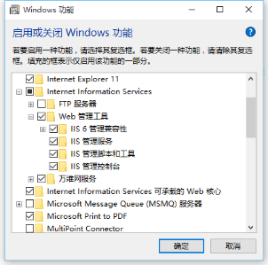

图 5.31 开启 IIS 相关的功能

 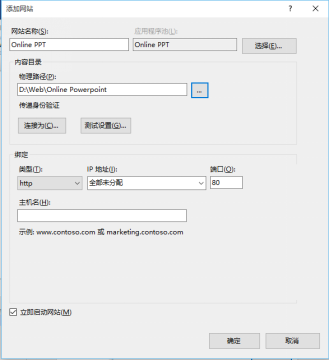

图 5.32 配置发布网站

 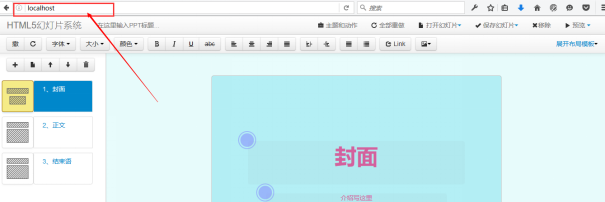

图 5.33 发布后输入网址访问效果

还有，作者本人花几块钱买了个花生壳的路由器映射功能，将电脑上的网站通过花生壳发布到一个免费的域名（在网上申请的一个免费域名）上，这样就可以让同学们也测试我的应用了。

 

图 5.34 花生壳域名映射配置

 

 

图 5.35 非本地网址访问应用

### 5.10  本章小结

本章主要介绍了基于 HTML5 的在线幻灯片系统的具体编码实现，详细介绍了系统的重要模块的实现、特色功能、与设计对比的系统界面、界面的兼容性调试和网站发布的实现和操作。

## 6  总结与展望

### 6.1  总结完成的工作

基于 HTML5 的在线幻灯片系统，是当初在张智老师的推荐下所选的课题。学生本人也认为这个话题在 web 应用方面有很大的意义，作为一个工具类的应用，是具有很长的发展时限的，特别是一款面向大众型工具，更是意义非凡。

在开题报告中，作者本人所描述的功能已经尽数实现，甚至在一些方面还实现了额外的功能。在实现本课题的过程中，作者本人学到了很多的东西，尤其是 js 方面的知识。虽然，在此之前，个人对 js 语言还有些许的轻视，但在学习和使用的过程中，发现它还可以实现面向对象的编程风格，以及它天生的动态化特性，相信随着该语言的发展，也会愈加完善和可爱。

最后，不可避免要说一下前端开发都会面临的问题——兼容性。如今而言，在线幻灯片系统在用户人数最多的 IE 面前没有什么问题，在火狐上更是能够实现完美的界面和功能，可是在 Google Chrome 上面，大纲区不能显示，其他功能没有受影响。作者本人能力有限，不能够找到其中的症结所在。

### 6.2  展望

基于 HTML5 的在线幻灯片系统，作为一个面向大众型的 Web 工具类应用，具有很强的发展前景。作者本人在研究实现课题的过程中发现有很多可以实现的新的功能，还有很多可以扩展的部分。

其中包括动态添加编辑框，实现编辑框的动作，调节图片编辑框的图片的图片编辑器，当前编辑框的动作预览和主题市场等等。后续中，作者本人可能会将该应用推到 github 上面，陆续实现这些功能，更新版本，完善在线幻灯片。

查看了百度百科关于 PowerPoint 的介绍，发现 PowerPoint 还有如此多的功能，这些既是方向，又是挑战。

## 参考文献

* [1] 胡军，刘伯成，刘晓强编著。Web 前端开发案例教程：HTML+CSS+JavaScript[M]. 北京：人民邮电出版社，2015
* [2] 刘玉红编著。CSS3+DIV 网页样式与布局案例课堂- [M]. 北京：清华大学出版社，2015
* [3] 袁江编著。jQuery 开发从入门到精通- [M]. 北京：清华大学出版社，2013
* [4] (美) Nicholas C. Zakas 尼古拉斯著。JavaScript 面向对象精要- [M]. 胡世杰译。北京：人民邮电出版社，2014
* [5] 曾探著。JavaScript 设计模式与开发实践- [M]. 北京：人民邮电出版社，2015
* [6]Alan Forbes. The Joy of Bootstrap: A Smarter Way to Learn the World's Most Popular Web Framework- [M].6 Aug 2014 
* [7]Nathan A. Rice. Knockout Js Self Study- [M]. 8 May 2015
* [8] 百度百科。HTML5- [OL]. http://baike.baidu.com/link?url=BO96dG9NmDs6mCia9P8OiwCBQiVoFxdgcnCxEG0SIj9sbrhXrTISXaMSIa5MxEqOhOGG6dvta5o4G6rEyaQqeK, 2015-11-29 
* [9] 百度百科。Microsoft Office PowerPoint- [OL]. http://baike.baidu.com/link?url=W9HajkqGmSGjkwIY6_7XWzn9uT9FLPdk9efMS4TU4ZZMiw58Ka370bBkZD4N1gy7V0ADjJob29TmBORxiATl8wGYG9Dlpa0yJMjevY4BOlKmghzHHJBvQbf0LJgjhszr_dyi5P2ZScoSq2vixe53EK, 2016-01-22

* [10] 百度百科。浏览器内核- [OL]. http://baike.baidu.com/link?url=p_zeam3AC60ium0EywW-6IWXL1spE1JNA5qjLIWexm0HVX2i3X-rUu1lY-eG3m4IaqNBHnNl8pat_kYo6EW4Z_, 2016-04-05

* [11] 百度百科。Sublime Text- [OL]. http://baike.baidu.com/link?url=UUeaW1kNcpYQ052XrG7wMeesV8M0XzLDIkAEvIp45YVzNz5sX6pQNTGmcdcqCTaPszTfPV4XnRqPnaU6kOMHwa, 2016-05-15

* [12] 百度百科。Axure RP- [OL]. http://baike.baidu.com/link?url=5-LEBnw4hlEDy4Rawqe_T7MFvW86IS5NP0lU6_SsIHyENuDdWwsrui0O3RPlMGnBKhba2K49WUVkKpob4bjw3a, 2015-06-17

* [13]W3School. HTML5 教程- [OL]. http://www.w3school.com.cn/html5/, 2016-3

* [14] 百度百科。Bootstrap- [OL]. http://baike.baidu.com/link?url=1iczg6kA5pT329sFvD-a3YHbxNp4G0ry6gMIjTjoGMoScvCy7w5gBFPruTEP6mtJqCf4pwCnlOiJduJEgQLCcsm9eliUa568-zqidlzbzmu, 2015-09-16

* [15]RequireJS 中文网。RequireJS- [OL]. http://www.requirejs.cn/home.html, 2016-4

* [16]Knockout 官网。Knockout [OL]: Introduction. http://knockoutjs.com/documentation/introduction.html, 2016-4
